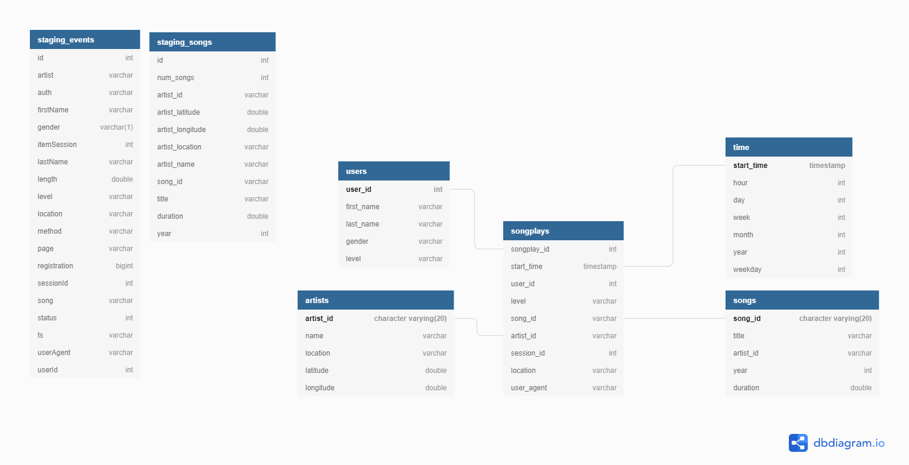

# SPARKIFY DWH MODEL USING AWS S3 AND REDSHIFT

## INTRODUCTION

Sparkify, a music streaming company, decided to move their processes and data onto the cloud to reduce cost.
Their data, logs about users activities and songs library, are stored in an AWS S3 bucket.

It is the data engineer duty to build an ETL pipeline that extracts data from the S3 bucket, stages it in Redshift, then transforms the data into facts and dimensional tables for analytics team to drive business insights regarding user behavior.

## PROJECT DESCRIPTION

Given the knowledge I've learned about data warehouses and AWS, this project require building an ETL pipeline for a database hosted on Redshift.
Creating a Redshift cluster is the fist step, then creating staging tables to hold the data coming from S3 bucket. Finally, create dimensional tables and insert data into them.
Now everything is ready for the analytics team.



## USING THE STAR SCHEMA TO MODEL DIMENSIONS AND FACT TABLES

Star schema is simple yet powerful, the concept is having one central table with all facts. Then connect dimensional tables to the fact table with foreign keys.
This schema is optimized for OLTP operations and user friendly.

## PROJECT STRUCTURE
The data is stored on an S3 bucket on AWS.
The configuration file, `dwh.cfg`, has all the information about the S3 bucket and how to configure the Redshift cluster;
```
[S3]
LOG_DATA=s3://udacity-dend/log_data
LOG_JSONPATH=s3://udacity-dend/log_json_path.json
SONG_DATA=s3://udacity-dend/song_data
```

`etl.py` contains the etl pipeline to move data from s3 buckets into staging tables on redshift and create dimensions and fact tables.
`sql_queries.py` all CRUD queries needed for this project.
`create_tables.py` is used to create facts and dimensional tables and drop them in-case you needed to reset you database.
`IaC.ipynb` is used to help creating the Redshift cluster and IAM role.

To run script:
1. Make sure you have a Redshift cluster running.
2. Run create_tables.py first to drop tables and create tables.
3. Run etl.py to activate the pipeline.
